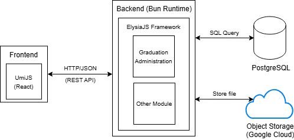
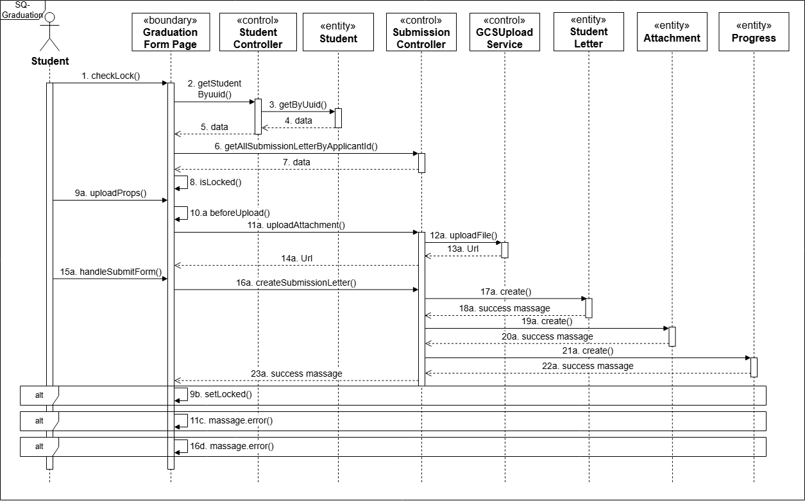
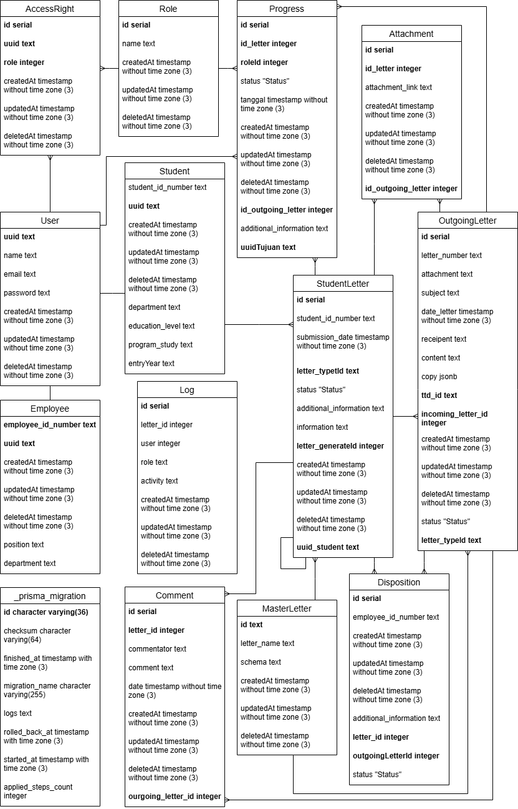

# Faculty Correspondence & Administration System 🎓

-blue)

## 📌 Project Overview
This project is a **funded research initiative** aimed at modernizing the faculty's administrative processes. As a key member of a 4-person research team, I was responsible for engineering the **Graduation Administration Module**.

The system replaces legacy manual workflows with a high-performance digital platform, handling complex document verification logic.

**Note:** *Source code is intellectual property of the research grant/university and is not publicly available. This repository serves as technical documentation.*

---

## 🏗️ High-Level Architecture
The backend is built on the **Bun runtime** using **ElysiaJS** framework to ensure maximum throughput and low latency. It communicates with a React (UmiJS) frontend.

 

---

## 🧠 Key Logic: Graduation Clearance Workflow
One of the most complex challenges was orchestrating the "Clearance Letter" validation. The system must verify approval from 3 distinct departments (Library, Finance, Faculty Tool) before unlocking the graduation application.

**Sequence Diagram:**

---

## 🗄️ Database Design (ERD)
I designed a normalized PostgreSQL schema to maintain data integrity across student records and approval logs.

---

## 🚀 Key Technical Contributions
- **Performance:** Leveraged **Bun**'s speed for API response times < 50ms.
- **Component Reusability:** Built the Graduation Module by extending shared backend components established by the core team.
- **Complex Validation:** Implemented a multi-step approval gatekeeper pattern.
